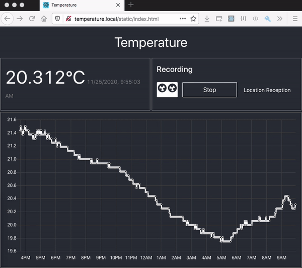

[](https://lerna.js.org/)

# Temperature

When having the chance to live in a large house, like me, setting up correctly the central heating can be not that trivial: you need understand how your house reacts when outside temperature goes up or down.
This fine-tuning means bringing permanent confort. But not only, it saves from emitting too much green gas.

Temperature want to help on that.

Put the raspberry in your room and start recording. It will collect the data, and show a nice graph.


## Hardware

A [RaspberryPi](https://www.raspberrypi.org), preferrably version 3 or more to have nice performance.

The temperature is measured with 1wire probe. A simple model like DS18B20+ by Maxim Integrated can make the job. This other is more expensive but more reliable: [TST100 by TeracomSystems](https://www.teracomsystems.com/sensors/1-wire-temperature-sensor-tst100/)

## Software

Temperature is made with NodeJS. It runs as a service. It uses a postgres database to persist the data. 

### Test

Run `yarn test`

### Deploy

An ansible playbook is provided. It deploys roles `httpd`, `postgres` and tasks related to `temperature`.

#### Prepare a config file

Copy the file `config.template.json` to `ansible/installs/files/config.json` and make it yours. This looks like:
```javascript
{
  "period" : "PT1M",
  "port" : 3300,
  "postgresql" :{
    "user": "postgres",
    "password": "very.secret",
    "host": "my.host.org",
    "port": 5432,
    "database": "postgres"
  },
  "one-wire" :{
    "path" : "/sys/bus/w1/devices/28-0414606b95ff/w1_slave"
  }
}
```

Period is written in [ISO8601](https://en.wikipedia.org/wiki/ISO_8601#Durations) format. Here PT1M stands for 1 minute.

To find the path of the 1Wire probe, explore what is under `/sys/bus/w1/devices`, there isn't many devices there.

#### Adapt the `hosts` file

Adapt the file `ansible/inventory/hosts` to where you want to deploy.

#### Deploy!

Move to directory `ansible` and run `ansible-playbook installs/temperature.yml`

### API

#### Get current temperature

Request:

`GET /api/temperature/current`

Response:
```javascript
{
    "timestamp": "2020-04-09T21:33:22Z",
    "value": "12.125"
}
```


#### Get current status

Request:

`GET /api/status`

Response:
```javascript
{
    "recording": true,
    "location": "bedroom"
}
```

 #### Get recorded temperatures

 ##### Last Nth temperatures

Request:

`GET /api/temperatures/bedroom?count=3`

Response:
```javascript
[
    {
        "timestamp": "2020-04-09T21:33:22Z",
        "value": "12.125"
    },
    {
        "timestamp": "2020-04-09T21:32:21Z",
        "value": "12.25"
    },
    {
        "timestamp": "2020-04-09T21:31:21Z",
        "value": "12.25"
    }
]
``` 


 ##### Get temperatures since a date

Request:

`GET /api/temperatures/bedroom/since/1984-01-20T08:00:00Z`

Date in [ISO8601](https://fr.wikipedia.org/wiki/ISO_8601) format

Response:
```javascript
[
    {
        "timestamp": "2020-04-09T21:33:22Z",
        "value": "12.125"
    },
    {
        "timestamp": "2020-04-09T21:32:21Z",
        "value": "12.25"
    },
    {
        "timestamp": "2020-04-09T21:31:21Z",
        "value": "12.25"
    }
]
``` 

##### Get temperatures for a period

Request:

`GET /api/temperatures/bedroom/for/P3D`

Duration in [ISO8601](https://fr.wikipedia.org/wiki/ISO_8601) format.  Here `P3D` is 3 days.

Response:
```javascript
[
    {
        "timestamp": "2020-04-09T21:33:22Z",
        "value": "12.125"
    },
    {
        "timestamp": "2020-04-09T21:32:21Z",
        "value": "12.25"
    },
    {
        "timestamp": "2020-04-09T21:31:21Z",
        "value": "12.25"
    }
]
``` 

#### Get status

Request:

`GET /api/status`

Response:
```javascript
{
    "version": "1.2.3",
    "recording": true,
    "location": "My room"
}
``` 

#### Get locations

Request:

`GET /api/locations`

Response:
```javascript
[
    {
        "location": "My room"
    },
    {
        "location": "My cellar"
    }
]
``` 

 #### Start recording at location

Request:

`POST /api/recording/start/location`

Payload:
```javascript
{
    "location": "My room"
}
```

#### Stop recording

Request:

`POST /api/recording/stop`
